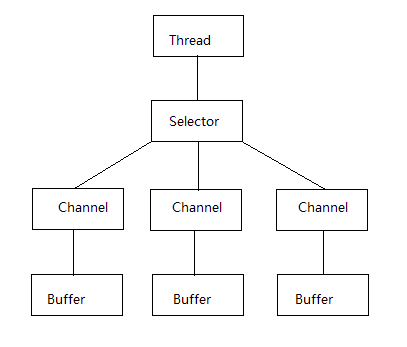

# netty框架学习 2020-03-13
# netty hello 2020-03-13
- netty执行流程分析与重要组件介绍
- netty回调与Channel执行流程分析
>- 主要看TestHttpServerHandler中复写父类的方法

# netty的Socket编程详解 2020-03-14
- netty能用来干嘛
>- http开发
>- socket相关开发
>- 支持长连接开发

- 基于socket编程
# websocket实现与原理分析(fifthexample)

# java nio 2020-03-21
- java.io
java.io 中最为核心的一个概念是流(Stream),面向流的编程. Java中, 一个流要么是输出流, 要么是输入流, 不可能同时既是输入流又是输出流
- java.nio
java.nio中拥有3个核心概念: Selector, Channel, Buffer. 在java.nio中, 我们是面向块(block)或是缓冲区(buffer)编程的  
   
>- Buffer本身就是一块内存,底层实现上,它实际上是个数组. 数据的读,写都是通过Buffer来实现的.  
除了数组之外,Buffer还提供了对于数据的结构化访问方式,并且可以追踪到系统的读写过程.  
Java中的7种原生数据类型都有各自对应的Buffer类型, 如IntBuffer, LongBuffer, CharBuffer, 并没有BooleanBuffer类型
>- Channel指的是可以向其写入数据或是从中读取数据的对象, 它类似于java.io中的Stream.  
所有数据的读写都是通过Buffer来进行的, 永远不会出现直接向Channel写入数据的情况, 或是直接从Channel读取数据的情况.  
于Stream不同的是, Channel是双向的, 一个流只可能是InputStream或是OutputStream, Channel可打开后则可以进行读取, 写入或是读写.  
由于Channel是双向的, 因此它更好地反映出底层操作系统的真实情况;在Linux系统中,底层操作系统的通道就是双向的.  
- 关于NIO Buffer中的3个重要状态属性的含义: position, limit, capacity.
  
  0 <= mark <= position <= limit <= capacity  
- 查看Buffer及其相关子类的源码
- 通过NIO读取文件涉及到3个步骤:
1. 从FileInputStream获取到FileChannel对象  
2. 创建Buffer  
3. 将数据从Channel读取到Buffer中  
- 绝对方法与相对方法的含义:  
1. 相对方法: limit值与position值会在操作时被考虑到  
2. 绝对方法: 完全忽略掉limit值与position值  
# NIO堆外内存与零拷贝深入理解  
- `DirectByteBuffer` 核心类, 了解其和ByteBuffer的区别, DirectByteBuffer零拷贝的原理

# java 网络编程
- 传统网络编程
服务端
```java
ServerSocket serverSocket = ...;
serverSocket.bind(8899);
while (true) {
  serverSocket.accept();// 阻塞方法
  new Thread(socket);
  run(){
    socket.getInputStream();
    ...
    ...
    ...
  }
}
```
客户端
```java
Socket socket = new Socket("localhost", 8899);
// 发起连接
socket.connect();
```
`NioTest12` 开始讲NIO中的selector

## 字符编码
- ASCII (American Standard Code for Information Interchange 美国信息交换标准代码)
7 bit来表示一个字符,共计可以表示128种字符.  
- ISO-8859-1  
8 bit表示一个字符,即用一个字节(byte)来表示一个字符, 共计可以表示256个字符  
- gb2312  
两个字节表示一个汉字.  
- gbk  
- gb18030 
- big5(台湾编码)
- unicode(最全字符编码方式)  采用两个字节来表示一个字符
- UTF(Unicode Translation Format)  
unicode是一种编码范式, 而UTF则是一种存储方式; utf-8是Unicode的实现方式之一.  
UTF-8: 变长字节表示形式  
一般来说, UTF-8会通过3个字节来表示一个中文.  
BOM(Byte Order Mark)


  
